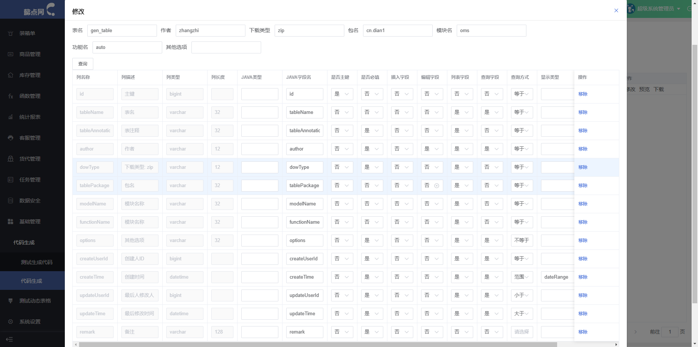
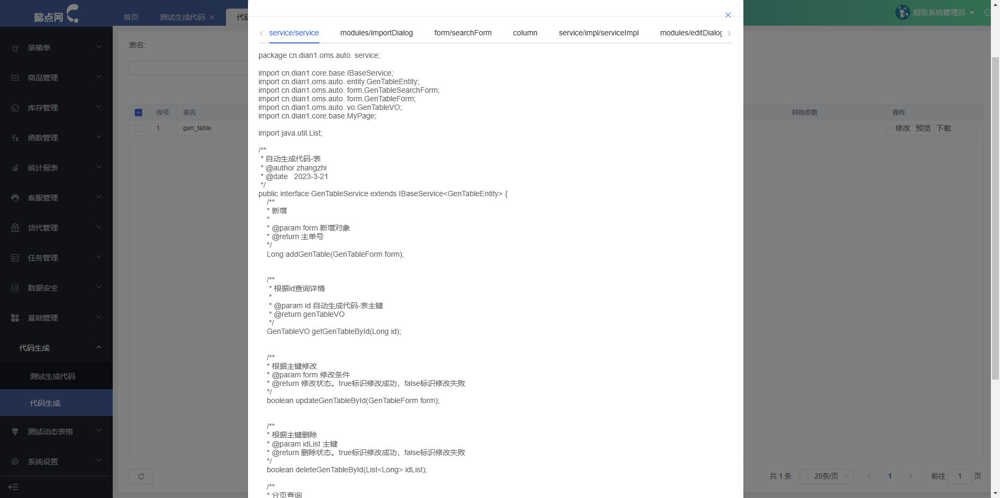

> 使用方法:

输入表明,点击查询.按照需要条件进行填充.java类型会自动根据数据库类型适配.
暂时只支持myhsql

> 提示

1. 完整包名为:包名.模块名.功能名
2. 是否必填:后端校验不能为空
3. 编辑字段:前端修改页面字段
4. 列表字段:前端展示字段
5. 查询字段:是否允许查询,前端查询
6. 查询方式:后端查询条件
7. 显示类型:待补充,前端能够展示的类型
8. 插入字段: 待完成

> 下载暂时只支持zip

> 前端页面展示:

修改:

预览:

